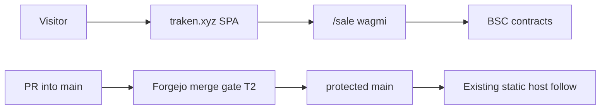
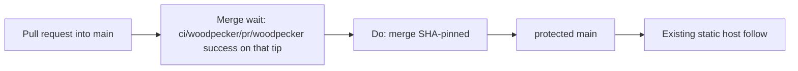

# Architecture overview

`code/tradair-landing` is the **Traken AI** visitor SPA (`https://traken.xyz`):
Create React App + React Router, marketing home, `/sale` (wagmi / RainbowKit,
BSC sale contracts), and legal pages. Product copy, style, and sale addresses
stay in [`README.md`](../README.md), [`STYLE_GUIDE.md`](../STYLE_GUIDE.md),
and `src/`. This file is the **merge gate** plus a short runtime index. Do not
copy README narrative here. Do not treat this file as a second product
architecture.

Catch-all `CODEOWNERS` removal is decided in
[ADR 0001](adr/0001-remove-catchall-codeowners.md)
([#2](https://git.cl8y.com/code/tradair-landing/issues/2)); do not duplicate
that narrative. Land vehicle, occupying PR, successor close-without-merge,
and design-branch transport live only in that ADR.

## Runtime

| Layer | Choice |
|-------|--------|
| App | CRA (`react-scripts` 5) + React 19. Routes in `src/App.js`: `/`, `/sale`, `/privacy`, `/terms`, `/cookies`, `/disclaimer`, `/ai-bias`. |
| Chain | BSC. Sale / token addresses in `src/constants/smart-contracts.js`. Not this ticket. |
| Host | Static site at `traken.xyz`. Git history records Render builds (`.npmrc` `legacy-peer-deps`). **No** in-tree `render.yaml`. `public/_redirects` is the SPA fallback. |
| Secrets | WalletConnect / RPC if any are host-side. Not this ticket. |
| CI file | None. No `.woodpecker.yaml` / `.woodpecker/`. No `.gitlab-ci.yml`. Required host context name (public `GET .../branches/main`, 2026-09-21): `ci/woodpecker/pr/woodpecker`. |
| Tests | `src/App.test.js` is leftover CRA smoke, not **T2-3**. |



Visitor copy, sale addresses, ABIs, `STYLE_GUIDE.md`, and `TODO.md` are
**unchanged** by ADR 0001. A static-host rebuild from a `main` push is
existing follow, not a
[#297](https://git.cl8y.com/PlasticDigits/cl8y-agent-control/issues/297)
deploy grant.

## Forgejo merge gate {#forgejo-merge-gate}

Official CODEOWNERS review is **not** a merge gate. Decision, slices, tests,
rollback: [ADR 0001](adr/0001-remove-catchall-codeowners.md). Host write-up:
[cl8y-forgejo#48](https://git.cl8y.com/PlasticDigits/cl8y-forgejo/issues/48)
and forgejo PR **#50** (`docs/INVARIANTS.md` + ADR 0003 item 8). The issue
body points at forgejo `docs/INVARIANTS.md`, not a file in this tree. Do not
fork INVARIANTS here. Deploy / spend / custody / policy expansion:
[agent-control #297](https://git.cl8y.com/PlasticDigits/cl8y-agent-control/issues/297)
— this ticket is none of those. Sister CAC autoland predicates are
[#429](https://git.cl8y.com/PlasticDigits/cl8y-agent-control/issues/429), not
this SPA. [hello#15](https://git.cl8y.com/code/hello/pulls/15) is the fleet
canary, not a local iid.

### Merge gate (T2)

Three contract groups. Operator leftover-complete
`GET /api/v1/repos/code/tradair-landing/branch_protections` must equal the
**protection** rows only. That list endpoint returns an **array**; pick
`rule_name == "main"` (or
`GET /api/v1/repos/code/tradair-landing/branch_protections/main`).
Unauthenticated GET of that endpoint is **401**. A green `react-scripts test`,
a Render rebuild, empty commit statuses, or a GET on a different `code/*`
repo is **not** proof of **T2-2**, **T2-8**, **T2-3**, **T2-9**, **T2-10**, or
**T2-5**. Fleet values recorded for #48 / `code/hello` are not proof for this
repo.

Unauthenticated `GET /api/v1/repos/code/tradair-landing/branches/main`
(2026-09-21) already returns this **public** slice. It is **not** the
six-flag leftover GET. Do **not** map `user_can_push` to **T2-2**
(`enable_push`). The dated context name below is the required Woodpecker
check (**T2-3**):

```json
{
  "protected": true,
  "required_approvals": 0,
  "enable_status_check": true,
  "status_check_contexts": ["ci/woodpecker/pr/woodpecker"],
  "user_can_push": false
}
```

`enable_status_check` and the context list already match **T2-8** / **T2-3**.
**T2-10**, **T2-5**, and `enable_push` are **absent** from this object;
leftover-complete and the T2-9/T2-10 land GET stay fail-closed **admin**
GETs.

#### Protection GET (six flags)

| ID | Flag | Required value |
| --- | --- | --- |
| **T2-2** | `enable_push` | `false` (no direct push to `main`) |
| **T2-8** | `enable_status_check` | `true` |
| **T2-3** | `status_check_contexts` | `["ci/woodpecker/pr/woodpecker"]` (array **equal**, not subset) |
| **T2-9** | `required_approvals` | `0` |
| **T2-10** | `block_on_official_review_requests` | `false` |
| **T2-5** | `block_on_rejected_reviews` | `true` |

GET equality is these six rows for the `main` rule. Merge procedure is not a
protection field.

**T2-2** is `enable_push == false` only. It does **not** mean “no force-push
of a PR branch.” It is **not** `user_can_push` on public `GET .../branches/main`.
Force-push allowlist fields (if the host exposes them) and
`apply_to_admins` stay
[cl8y-forgejo#48](https://git.cl8y.com/PlasticDigits/cl8y-forgejo/issues/48),
not this ticket.

A leftover official CODEOWNERS request on an open PR is non-blocking
**only if** a dated **admin** GET of **this** repo’s `main` rule shows
**T2-9** and **T2-10**. Public `required_approvals: 0` on `branches/main` is
not that GET. If `block_on_official_review_requests` is still `true` here,
merge is 405; that stop is a
[cl8y-forgejo#48](https://git.cl8y.com/PlasticDigits/cl8y-forgejo/issues/48)
dependency, not a silent implement stop. Do not infer those two flags from
fleet #48.

This tree has **no** `.woodpecker.yaml` / `.woodpecker/`. Adding a pipeline
is **not** this standing contract (ADR 0001 non-goal). Do not copy hello’s
yaml. Merge of a PR into `main` **waits** on `ci/woodpecker/pr/woodpecker`
success on **that** tip (**T2-8** / **T2-3**). Missing statuses are a
host/CI gap, not a reason to keep or restore catch-all CODEOWNERS, fake a
context, or `force_merge`. CI-enablement ownership is ADR 0001, not a
pipeline in this tree.

#### Merge procedure

| ID | Rule |
| --- | --- |
| **T2-4** | SHA-pinned `Do: merge` with `head_commit_id`. Never document or use `force_merge`. |

#### Tree contracts

| ID | Rule |
| --- | --- |
| **T2-1** | `test -f` fails on `CODEOWNERS`, `docs/CODEOWNERS`, `.gitea/CODEOWNERS`, and `.forgejo/CODEOWNERS`. |
| **T2-6** | Static host stays `main`-follow (existing Render dashboard if any). This ticket does not add PR deploys, `render.yaml`, rotate sale/token addresses, edit `src/` / `public/` / `package.json` / `package-lock.json` / `.npmrc` / `.nvmrc`, or treat a host rebuild as leftover-complete. Host secrets never attach to `pull_request` events. |
| **T2-7** | This tree does not expand CAC merge/deploy/spend/custody policy. |

Forgejo loads CODEOWNERS from `pr.BaseRepo.DefaultBranch`, first existing file
among `CODEOWNERS`, `docs/CODEOWNERS`, `.gitea/CODEOWNERS`, and
`.forgejo/CODEOWNERS` (Go-regexp, not GitHub globs; `.forgejo/` added in
forgejo#8773; `.gitea/` remains in the walk). **T2-1** is the standing rule:
those four paths are **absent** (ADR 0001). None of them may contain a
reviewer rule for any pattern (ADR 0001 Decision 2). Do not leave an empty
or comments-only file; Forgejo still parses it.



This flowchart is the **merge** wait named by public `GET .../branches/main`
(2026-09-21). **Leftover-complete** is a separate admin GET of the six
protection flags; do not treat this diagram as that GET.

`react-scripts test` / `react-scripts build` are contributor checks, not
**T2-3**. Host merge still waits on the Woodpecker context above.

This tree does not change Forgejo protection JSON, CAC autoland predicates, or
host app config. Those remain
[cl8y-forgejo#48](https://git.cl8y.com/PlasticDigits/cl8y-forgejo/issues/48),
[cl8y-agent-control#429](https://git.cl8y.com/PlasticDigits/cl8y-agent-control/issues/429),
and [agent-control #297](https://git.cl8y.com/PlasticDigits/cl8y-agent-control/issues/297)
respectively.

## Directory (agents)

```
src/App.js                 routes
src/components/            marketing UI
src/pages/                 sale + legal
src/constants/             links, sale/token addresses, ABIs
public/_redirects          SPA fallback
STYLE_GUIDE.md             visual identity
README.md                  product map; Contributing pointer is ADR 0001 Decision 3
docs/adr/                  versioned decisions
docs/architecture.md       this file (merge gate T2; not product architecture)
CODEOWNERS                 absent (removed by ADR 0001; T2-1)
```

## ADRs

| ADR | Topic |
|-----|--------|
| [0001](adr/0001-remove-catchall-codeowners.md) | Remove catch-all CODEOWNERS ([#2](https://git.cl8y.com/code/tradair-landing/issues/2)) |
